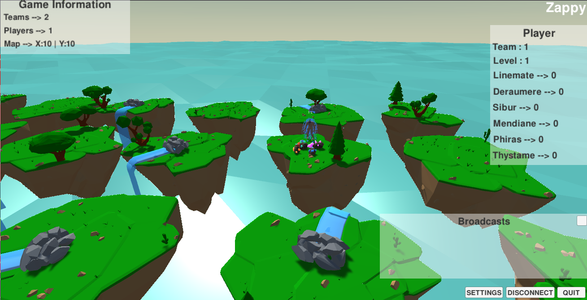

***********
Part 2: GUI
***********

Description
===========
To have a better vision of the game, which is simple, clear and ergonomic,
we made a user interface with the Unity engine.
We will describe below how our GUI works.

Main menu
=========
First of all, a main menu will appear.
To launch the game you just have to enter the ip of the server and its corresponding port.
In this menu, it is also possible to set the keys and the sensitivity.

.. code:: C#

    public void setHostText(string value) {
        host_text.GetComponent<UnityEngine.UI.InputField>().text = value;
        host = value;
    }
    public void setPortText(string value) {
        port_text.GetComponent<UnityEngine.UI.InputField>().text = value;
        port = value;
    }
    public void click_connect() {
        string host = host_text.GetComponent<UnityEngine.UI.InputField>().text;
        string port = port_text.GetComponent<UnityEngine.UI.InputField>().text;

        connect_menu.GetComponent<Connect_menu>().setInfos(host, int.Parse(port));
        connect_menu.SetActive(true);
    }
    public void click_settings() {
        host = host_text.GetComponent<UnityEngine.UI.InputField>().text;
        port = port_text.GetComponent<UnityEngine.UI.InputField>().text;
        instance.SetActive(false);
        leave_button.GetComponent<Leave_settings>().main = true;
        settings_menu.SetActive(true);
    }

Attempt server information
==========================
Once the connection information is filled in, the game will wait for information from the server (map size, game time, teams and players, ...).
When all the information sent by the server are received by the game, it will start the game automatically.

.. code:: C#

    public void validateMsz() {
        if (validations.Contains("msz"))
            return;
        map_text.GetComponent<Loading_text>().validate();
        validations.Add("msz");
        connection_controller.GetComponent<Connection_manager>().send("tna");
        finalValidation();
    }
    public void validateTna() {
        if (validations.Contains("tna"))
            return;
        validations.Add("tna");
        teams_text.GetComponent<Loading_text>().validate();
        connection_controller.GetComponent<Connection_manager>().send("sgt");
        finalValidation();
    }
    public void validateSgt() {
        if (validations.Contains("sgt"))
            return;
        validations.Add("sgt");
        time_text.GetComponent<Loading_text>().validate();
        connection_controller.GetComponent<Connection_manager>().send("pls");
        finalValidation();
    }
    public void validatePls() {
        if (validations.Contains("pls"))
            return;
        validations.Add("pls");
        pls_text.GetComponent<Loading_text>().validate();
        finalValidation();
    }

The complete game
=================
In the game, you can see the different islands that represent the tiles of the map.
Each island contains food and minerals.
The players move between the islands to collect resources.
In real time, the information of the map are displayed, as well as the broadcast of the players that can be deciphered.
By clicking on the islands or players, we can see what they contain (resources, inventory, ...)

.. note::

The gui is in permanent waiting of a command,
once this one received, it will compare it in the file **Args_manager.cs**
and execute the action in the **Commands.cs** script.
