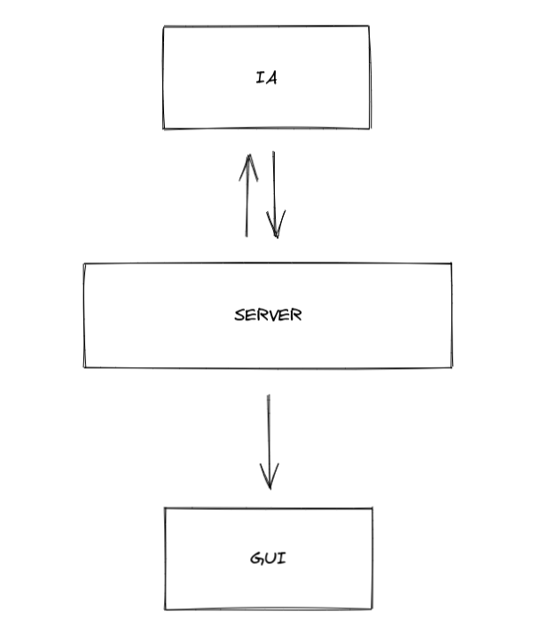

*****
Zappy
*****

Welcome to our Zappy documentation!
===================================

**Zappy** is the final project made in our second year in Epitech.
The goal of this project is to create a network game.
Several teams confront on a tiles map containing resources.
The winning team is the one with 6 players who reached maximum elevation.
The following documentation describe all the details and constraints.

Thus there is three parts to this project:

- **The server:** the project core that manages the entire game in a network.
- **The graphical interface:** interprets the commands received by the server and displays a result on a 3d map.
- **The artificial intelligence:** takes posession of the players to make them level up in an optimized way.

Schema
======

--> Represents the interaction between SERVER/IA and SERVER/GUI.

Information
===========

.. note::

   We are a team of 6 students on this project.
   To divide the work, 2 people are in charge of each of the 3 parts that will be detailed in this documentation.

.. warning::

   This project requires a lot of work during 4 weeks.
   Time management must be well thought out in order to complete this project on time!

Contents
========
.. toctree::
   Usage
   Commands
   Server
   GUI
   IA
   Teams
   Time
   Object
   Reproduction
   Inventory
   Broadcast
   Ejection